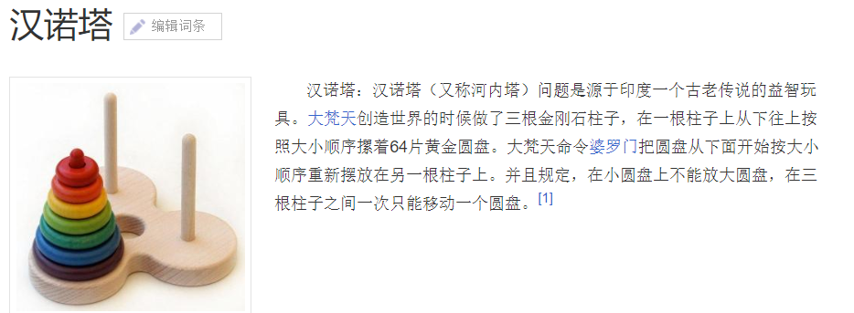
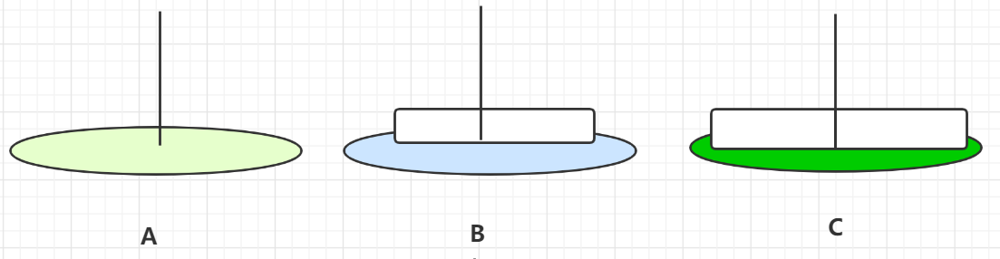

# Java结合方法栈帧理解递归编程思想

## 递归的介绍

>In computer programming, the term **recursive** describes a function or method that repeatedly calculates a smaller part of itself to arrive at the final result. It is similar to [iteration](https://www.computerhope.com/jargon/i/iteration.htm), but instead of repeating a set of operations, a recursive function accomplishes repetition by referring to itself in its own definition. While the concept of recursive programming can be difficult to grasp initially, mastering it can be very useful. Recursion is one of the fundamental tools of computer science.

在计算机编程中，递归描述了一个函数或方法重复计算自身的更小部分单元，从而获得最终结果。有点类似于迭代，但不是重复一系列的普通操作，而是在自身定义里面重复调用自身完成。递归的概念确实比较难以理解，但是理解后是极其有用的。递归是计算机科学的工具之一。


上面是比较学术化的说法，关于递归，简而言之——函数（或者某些语言叫方法）体里面又调用了自身，从而得到最终的结果。


**递归的注意事项**

- 一定要保证递归终止的条件，否则会陷入无限调用的噩梦
- 每次递归，应该可以解决更小的子集问题


## 阶乘——递归入门案例

阶乘：是最好的递归案例。

0的阶乘=1; -----  因为1!=1，根据1!=1*0!，所以0!=1而不是0。

1的阶乘=1;

2的阶乘=2*1!=2;

3的阶乘=3*2!=6;

4的阶乘=4*3!=24;

我们发现一个非负数的阶乘 = 其值*(其值-1)!

在编程，求一个给定数的阶时可以这么实现：

```java
private int factorial(int i){
    if( i <= 1 ){
        return 1;
    }else{
        return i * factorial(i-1);
    }
}

```

结果验证....没毛病！


## 递归和方法栈

回顾一下：JMM内存模型。


对于上面代码：

```java
private int factorial(int i){
    if( i <= 1 ){
        return 1;
    }else{
        return i * factorial(i-1);
    }
}
```


结合JMM模型来分析一下，每个方法调用时都有属于自己的栈帧；  所以每次调用时都会

①保存当前这次栈帧的局部变量

②操作，去继续调用比它小1的栈帧

③继续执行①-③，知道找到最后一个——递归终止条件return 1

④方法逐步返回，回到上一层的栈帧.....直到最开始的栈帧，拿到结果，出栈。


这个过程需要大量栈帧，我们知道栈帧是需要一定的内存的，所以空间损耗很大；


## 尾递归优化

尾递归——当递归调用时最后的语句是函数自身，并且没有任何其他的表达式；

对于尾递归，现代编译器会对其做优化，复用栈帧。

改写，使用尾递归，复用栈帧：

```java
private  int factorial2(int i, int result){
    if( i <= 1 ){
        return result;
    }else{
        return factorial2(i-1, i*result);
    }
}
```

最后的执行语句仅仅包含方法自身，则可以复用栈帧，只要一个栈帧即可。


## 汉诺塔实现

理解了递归思想后，来看一看当初数据结构课上的一个案例：汉诺塔。




对于初学者，这个案例看着很头疼...似乎陷入了无解的状态....


- 圆盘一开始全部像叠罗汉一样都在A，有空柱子B、C；

- 最终要求全部放到C盘； 
- 盘移动过程中可以在任意柱子；
- 一次只能移动一个盘；
- 移动期间，需保证所有的柱子都是底层为大盘，上面的为小盘；


**分析**

这个问题如果存在解，那么应该是采用递归、循环来实现；

递归？ 如何递归？

如何拆分任务子集？

**实现**


假设A上面存在2个圆盘——要原样移动到C，需要经历以下步骤；

A移动到B


A移动到C



B移动到C


> 同样的N个，可以把下面的N-1整体看成一个，最上面一个，合起来算做两个；按上面的操作完成；
>
> 这就是不断地细分，每一块又是重复的动作，可以递归实现。


**本质上就是一个入栈、出栈的过程**


```c++
// 将 n 个圆盘从 a 经由 b 移动到 c 上
public void hanoid(int n, char a, char b, char c) {
    if (n <= 0) {
        return;
    }
    // 将上面的  n-1 个圆盘移到 B
    hanoid(n-1, a, c, b);
    // 此时将 A 底下的那块最大的圆盘移到 C
    move(a, c);
    // 再将 B 上的 n-1 个圆盘经由A移到 C上
    hanoid(n-1, b, a, c);
}

public void move(char a, char b) {
    printf("%c->%c\n", a, b);
}
```

